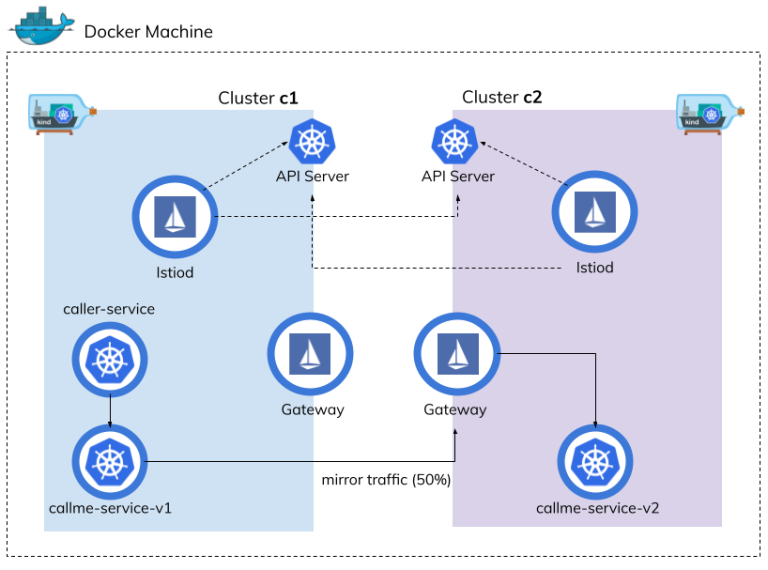

# Multicluster Traffic Mirroring with Istio and Kind

<https://piotrminkowski.com/2021/07/12/multicluster-traffic-mirroring-with-istio-and-kind/>



```shell
## Create Kubernetes clusters with Kind
kind create cluster --name c1
kind create cluster --name c2
kind get clusters
kubectx | grep kind

kubectl cluster-info --context kind-c1
kubectl cluster-info --context kind-c2

## Delete Kubernetes clusters with Kind
kind delete cluster --name c1
kind delete cluster --name c2

## Install MetalLB on Kubernetes clusters
kubectl apply -f https://raw.githubusercontent.com/metallb/metallb/master/manifests/namespace.yaml --context kind-c1
kubectl create secret generic -n metallb-system memberlist --from-literal=secretkey="$(openssl rand -base64 128)" --context kind-c1
kubectl apply -f https://raw.githubusercontent.com/metallb/metallb/master/manifests/metallb.yaml --context kind-c1

kubectl apply -f https://raw.githubusercontent.com/metallb/metallb/master/manifests/namespace.yaml --context kind-c2
kubectl create secret generic -n metallb-system memberlist --from-literal=secretkey="$(openssl rand -base64 128)" --context kind-c2
kubectl apply -f https://raw.githubusercontent.com/metallb/metallb/master/manifests/metallb.yaml --context kind-c2

## Get docker network ip
docker network inspect -f '{{.IPAM.Config}}' kind 

## Change IP on your get from above command
kubectl apply -f k8s/metallb-c1.yaml --context kind-c1
kubectl apply -f k8s/metallb-c2.yaml --context kind-c2

## Install Istio on Kubernetes in multicluster mode
cd istio-1.10.3/tools/certs/
make -f Makefile.selfsigned.mk root-ca
make -f Makefile.selfsigned.mk kind-c1-cacerts
make -f Makefile.selfsigned.mk kind-c2-cacerts

kubectl create namespace istio-system --context kind-c1
kubectl create secret generic cacerts -n istio-system \
      --from-file=kind-c1/ca-cert.pem \
      --from-file=kind-c1/ca-key.pem \
      --from-file=kind-c1/root-cert.pem \
      --from-file=kind-c1/cert-chain.pem \
      --context kind-c1

kubectl create namespace istio-system --context kind-c2
kubectl create secret generic cacerts -n istio-system \
      --from-file=kind-c1/ca-cert.pem \
      --from-file=kind-c1/ca-key.pem \
      --from-file=kind-c1/root-cert.pem \
      --from-file=kind-c1/cert-chain.pem \
      --context kind-c2

cd ../../../

kubectl --context kind-c1 label namespace istio-system topology.istio.io/network=network1
istioctl install -f k8s/istio-c1.yaml --context kind-c1

kubectl --context kind-c2 label namespace istio-system topology.istio.io/network=network2
istioctl install -f k8s/istio-c2.yaml --context kind-c2


## Configure multicluster connectivity
kubectl apply -f k8s/istio-cross-gateway.yaml --context kind-c1
kubectl apply -f k8s/istio-cross-gateway.yaml --context kind-c2

istioctl x create-remote-secret --context=kind-c1 --name=kind-c1 
istioctl x create-remote-secret --context=kind-c2 --name=kind-c2 

kubectl apply -f k8s/secret1.yaml --context kind-c2
kubectl apply -f k8s/secret2.yaml --context kind-c1

## Configure Mirroring with Istio
kubectl label --context kind-c1 namespace default istio-injection=enabled
kubectl label --context kind-c2 namespace default istio-injection=enabled


## Deploy application callme-service
brew install skaffold

cd callme-service
mvn clean package
docker build -t boriphuth/callme-service:1.1.0 .
docker push boriphuth/callme-service:1.1.0

skaffold init --force
skaffold dev --port-forward

cd caller-service

mvn clean package
docker build -t boriphuth/caller-service:1.1.0 .
docker push boriphuth/caller-service:1.1.0

skaffold init --force
skaffold dev --port-forward

kubectl apply -f callme-service/k8s/deployment_v1.yaml --context kind-c1
kubectl apply -f callme-service/k8s/deployment_v2.yaml --context kind-c1
kubectl apply -f caller-service/k8s/deployment.yaml --context kind-c1
kubectl apply -f callme-service/k8s/istio-rules.yaml --context kind-c1
kubectl apply -f caller-service/k8s/istio-rules.yaml --context kind-c1
kubectl get pod --context kind-c1


kubectl apply -f callme-service/k8s/deployment_v2.yaml --context kind-c2
kubectl get pod --context kind-c2

kubectl run curl-test --image=radial/busyboxplus:curl -i --tty --rm
[ root@curl-test:/ ]$ nslookup callme-service
Server:    10.96.0.10
Address 1: 10.96.0.10 kube-dns.kube-system.svc.cluster.local

Name:      callme-service
Address 1: 10.96.190.192 callme-service.default.svc.cluster.local

[ root@curl-test:/ ]$ nslookup caller-service
Server:    10.96.0.10
Address 1: 10.96.0.10 kube-dns.kube-system.svc.cluster.local

Name:      caller-service
Address 1: 10.96.20.124 caller-service.default.svc.cluster.local
[ root@curl-test:/ ]$ 

ping callme-service
ping caller-service

curl http://callme-service:8080/callme/ping

curl http://caller.example.com/caller/ping

siege -r 20 -c 1 http://localhost:8080/caller/service

siege -r 20 -c 1 http://localhost:8080/callme/ping
siege -r 20 -c 1 http://localhost:8080/callme/ping-with-random-error
siege -r 20 -c 1 http://localhost:8080/callme/ping-with-random-delay

kubectl logs pod/callme-service-v1-74466bbdc9-5r7xc --context kind-c1
kubectl logs pod/callme-service-v2-79f7bd4649-8cwb2 --context kind-c1

```